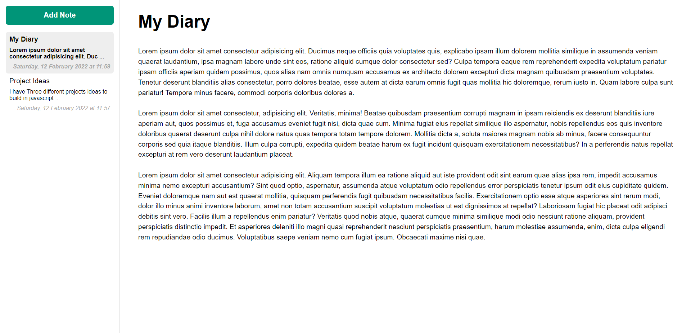

# Note Taking App: My Notebook

This is a solution the complete code of my note taking app called **My Notebook**.

## Table of contents

  - [Overview](#overview)
    - [The Features](#Features)
    - [Screenshot](#screenshot)
    - [Links](#links)
    - [Built with](#built-with)

## Overview

In the process of building this app i divided all my javascript code in three main modules.
- ***NotesAPI.js***: is responsible for interacting with browser local storage retrieving items from local storage, storing new items and deleting items.
- ***NotesView.js***: is responsible for all the view related stuff. at start loading the minimal ui, creating content for each note HTML, updating the notes preview list, updating the active notes.
- ***App.js***: is responsible for taking both **NotesApi** and **NotesView** modules and converting the whole app in working by defining different interaction based function like onSelect, onEdit, onAdd and onDeletion of a note and then refreshing the UI by calling updateNoteList Method from **NotesView**, adding new items in local storage with **NoteApi** module saveNote Method or Modifying the Active notes with the help of updateActiveNote method from **NotesView** Module.
  

### Features 

- User can add notes.
- User can navigate between different notes.
- User can edit note by clicking on note and then editing it.
- User can delete note double clicking on notes.
- All the notes are sorting based on time last modified.
- All the notes are saved in local storage user can refresh the page and all the notes will remains there.

### Screenshot

### Links

- Live Site URL: [live site URL here](https://shahabbukhari.github.io/DevNation/07%20-%20Note%20Taking%20App/index.html)

### Built with

- Semantic HTML5 markup
- CSS custom properties
- Flex-box
- Local storage
- JavaScript Modules 